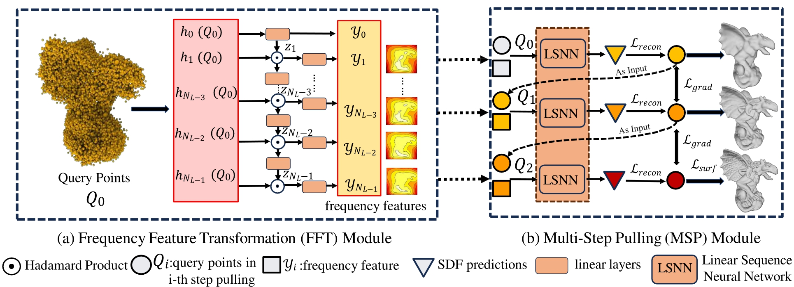
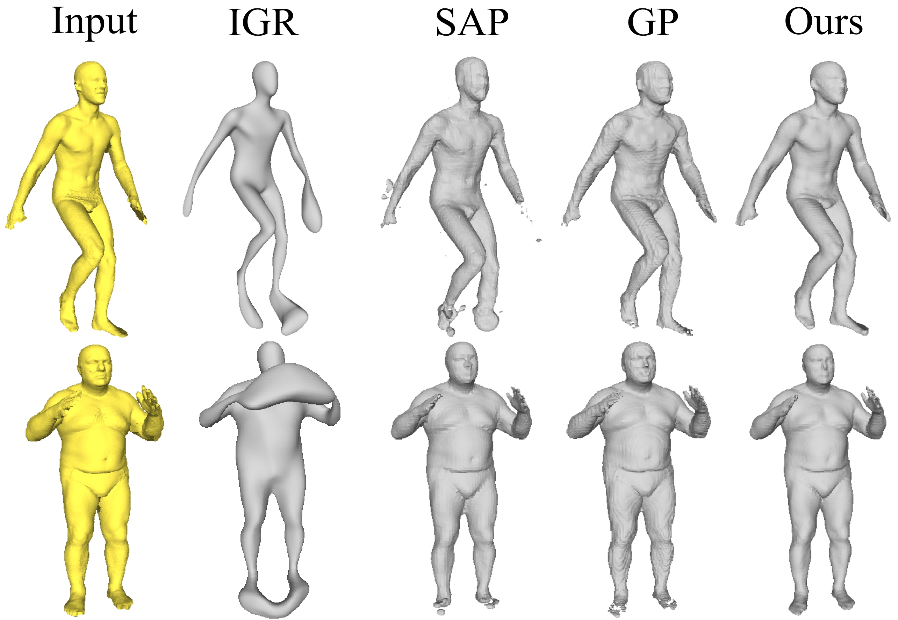
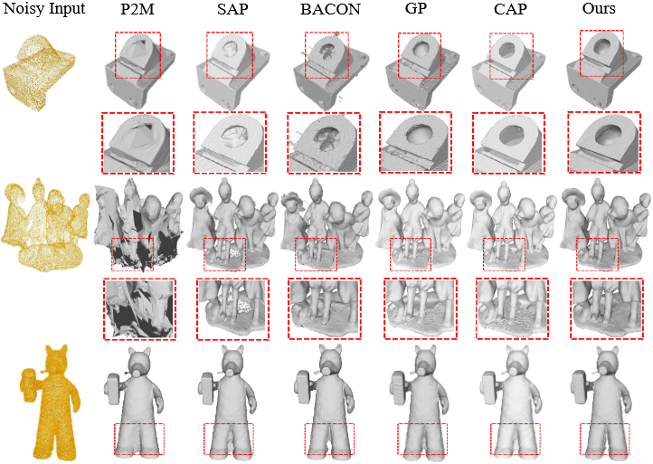
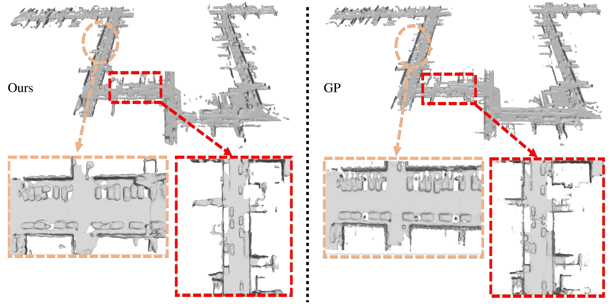

<p align="center">

<h1 align="center">MultiPull: Detailing Signed Distance Functions by Pulling Multi-Level Queries at Multi-Step</h1>
  <p align="center">
    <a href="https://github.com/takeshie/"><strong>Takeshi Noda*</strong></a>
    ·
    <a href="https://github.com/chenchao15/"><strong>Chao Chen*</strong></a>
    ·
    <a href="https://github.com/Wei-Qi/"><strong>Weiqi Zhang</strong></a>
    ·
    <a href="https://github.com/liuxinhai/"><strong>Xinhai Liu</strong></a>
    ·
    <a href="https://yushen-liu.github.io/"><strong>Yu-Shen Liu</strong></a>
    ·
    <a href="https://h312h.github.io/"><strong>Zhizhong Han</strong></a>

</p>
  <p align="center"><strong>(* Equal Contribution)</strong></p>
  <h2 align="center">NeurIPS 2024</h2>
  <h3 align="center"><a href="https://arxiv.org/pdf/2411.01208">Paper</a> | <a href="https://github.com/takeshie/MultiPull">Project Page</a></h3>
  <div align="center"></div>
</p>


## Overview

<p align="center">
  
</p>

Overview of our method: (a) Frequency Feature Transformation (FFT) module and (b) Multi-Step Pulling (MSP) module. In (a), we learn Fourier bases $h_{i}(Q)$ from query points $Q$ using the Fourier layer and obtain multi-level frequency features $ {y_{i}}$ through Hadamard product. In (b), using multi-level frequency features from (a) and a linear network \textbf{LSNN} with shared parameters, we calculate the distance(D) of $Q_ {i}$ to its corresponding surface target point $Q_{t}$ to predict a more accurate surface. We visualize the predicted SDF distribution map corresponding to the frequency features in (a) and the reconstruction from each step of SDF predictions on the right side of (b).

## Demo Results

### D-FUAST

<p align="center">
  
</p>

### SRB

<p align="center">
  
</p>

### KITTI

<p align="center">
  
</p>

## Related works

Please also check out the following works that inspire us a lot:

* [Junsheng Zhou et al. - # CAP-UDF: Learning Unsigned Distance Functions Progressively from Raw Point Clouds with Consistency-Aware Field Optimization (TPAMI 2024)](https://github.com/junshengzhou/CAP-UDF/)
* [Chao Chen et al. - Gridpull: Towards Scalability in Learning Implicit Representations from 3D Point Clouds (ICCV 2023)](https://github.com/chenchao15/GridPull/)
* [Baorui Ma et al. - Neural-Pull: Learning Signed Distance Functions from Point Clouds by Learning to Pull Space onto Surfaces (ICML2021)](https://github.com/mabaorui/NeuralPull/)

## Installation

Our code is implemented in Python 3.8, PyTorch 1.11.0 and CUDA 11.3.

- Install python Dependencies
  
  ```bash
  conda create -n mmpull python=3.8
  conda activate mmpull
  conda install pytorch torchvision torchaudio cudatoolkit=11.3 -c pytorch
  pip install tqdm pyhocon==0.3.57 trimesh PyMCubes scipy point_cloud_utils==0.29.7
  ```
- Compile C++ extensions
  
  ```
  cd extensions/chamfer_dist
  python setup.py install
  ```

## Dataset

We provide the input point cloud data and pretrained model in **/data/dfaust**  as example. The datasets is organised as follows:

```
│data/
├──dfaust/
│  ├── input.txt 
│  ├── inpu_data
│  ├── query_data 

```

## Train

You can train our method to reconstruct surfaces from a single point cloud as:

- ShapeNetCars
  
  ```
  python run.py --gpu 0 --conf confs/dfaust.conf --filelist input.txt
  ```

You can find the generated mesh and the log in `./outs`.


## Use Your Own Data

We also provide the instructions for training your own data in the following.

### Data

First, you should put your own data to the `./data/Custom_Dataset/input_data` folder, and mark data names/ID in `input.txt`. The datasets is organised as follows:

```
data/
├──Custom_Dataset/
│  ├── input_data
│      ├── (dataname).ply/xyz/npy
│  ├── input.txt
│  ├── query_data.txt
```

### Run

To train your own data, simply run:

```
python run.py --gpu 0 --conf confs/<your config> --filelist <your filelist> --dir (dataname)
```

### Notice

The scale of the sampling range has a significant impact on the quality of the final reconstruction results. We give `0.25 * np.sqrt(POINT_NUM_GT / 20000)` here as a reference value for processing input query points, and this value can be used for most object-level reconstructions. 

## Citation

If you find our code or paper useful, please consider citing

    @inproceedings{nodamultipull,
      title={MultiPull: Detailing Signed Distance Functions by Pulling Multi-Level Queries at Multi-Step},
      author={Noda, Takeshi and Chen, Chao and Zhang, Weiqi and Liu, Xinhai and Liu, Yu-Shen and Han, Zhizhong},
      booktitle={The Thirty-eighth Annual Conference on Neural Information Processing Systems}
      year = {2024}
